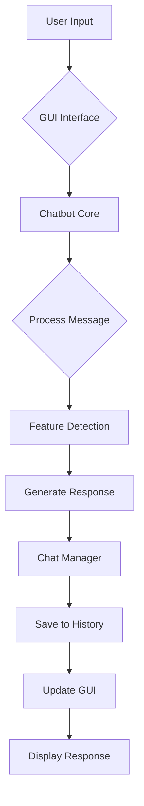

# 🤖 Chatbot

<div align="center">


**Chatbot canggih dengan GUI modern yang dibangun menggunakan Python dan Tkinter**

[Fitur](#-fitur) • [Instalasi](#-instalasi) • [Penggunaan](#-penggunaan) • [Dokumentasi](#-dokumentasi) • [Struktur Project](#-struktur-project)

</div>

## 📋 Daftar Isi

- [Gambaran Umum](#-gambaran-umum)
- [Fitur](#-fitur)
- [Instalasi](#-instalasi)
- [Penggunaan](#-penggunaan)
- [Dokumentasi](#-dokumentasi)
- [Struktur Project](#-struktur-project)
- [Konfigurasi](#-konfigurasi)
- [API Reference](#-api-reference)
- [Contoh Penggunaan](#-contoh-penggunaan)
- [Pengembangan](#-pengembangan)
- [FAQ](#-faq)

## 🚀 Gambaran Umum

**Chatbot** adalah aplikasi chatbot canggih dengan antarmuka grafis modern yang dibangun menggunakan Python dan Tkinter. Chatbot ini tidak hanya mampu melakukan percakapan sehari-hari, tetapi juga dilengkapi dengan berbagai fitur tambahan seperti kalkulator, manajemen chat history, export data, dan sistem penyimpanan otomatis.

### ✨ Highlights

- 🎨 **GUI Modern** dengan tema dark yang eye-friendly
- 💾 **Penyimpanan Otomatis** semua percakapan
- 🧮 **Kalkulator Built-in** untuk perhitungan matematika
- 📊 **Statistik Real-time** percakapan
- 🚀 **Multi-feature** dengan berbagai kemampuan
- 📁 **Export Data** ke berbagai format

## 🌟 Fitur

### 🤖 Core Features
- **Percakapan Natural** - Berbicara layaknya manusia
- **Konteks Percakapan** - Memahami alur pembicaraan
- **Multiple Responses** - Variasi respons yang beragam
- **Emoji Support** - Komunikasi yang lebih ekspresif

### 🛠️ Utility Features
- **🧮 Kalkulator** - Hitung ekspresi matematika langsung di chat
- **⏰ Time & Date** - Informasi waktu real-time
- **🌤️ Weather Info** - Informasi cuaca (simulasi)
- **😄 Joke Teller** - Cerita lucu programming
- **💪 Motivational Quotes** - Kutipan inspiratif
- **📚 Help System** - Panduan penggunaan lengkap

### 💾 Data Management
- **Auto-save** - Setiap pesan langsung tersimpan
- **JSON Storage** - Format penyimpanan terstruktur
- **Export Capability** - Ekspor chat ke file teks
- **Chat History** - Akses riwayat percakapan
- **Multiple Sessions** - Kelola banyak sesi chat

### 🎨 GUI Features
- **Dark Theme** - Tema gelap modern
- **Responsive Design** - Adaptif berbagai ukuran layar
- **Real-time Stats** - Statistik percakapan live
- **Keyboard Shortcuts** - Navigasi cepat dengan keyboard
- **Smooth Scrolling** - Pengalaman chat yang nyaman

## 📥 Instalasi

### Prerequisites

- Python 3.7 atau lebih tinggi
- pip (Python package manager)

### Step-by-Step Installation

1. **Clone atau Download Repository**
   ```bash
   git clone https://github.com/username/super-python-chatbot.git
   cd super-python-chatbot
   ```

2. **Buat Virtual Environment (Recommended)**
   ```bash
   python -m venv chatbot_env
   source chatbot_env/bin/activate  # Linux/Mac
   chatbot_env\Scripts\activate    # Windows
   ```

3. **Install Dependencies**
   ```bash
   pip install -r requirements.txt
   ```

4. **Verifikasi Instalasi**
   ```bash
   python main.py
   ```

### Quick Install (Windows)
```bash
# Download dan ekstrak project
python main.py
```

## 🎮 Penggunaan

### Menjalankan Aplikasi

```bash
python main.py
```

### Basic Usage

1. **Memulai Percakapan**
   - Ketik pesan di input field bawah
   - Tekan `Enter` atau klik tombol "Kirim 🚀"

2. **Fitur Khusus**
   ```
   /help      - Menampilkan semua fitur
   /clear     - Membersihkan chat
   /time      - Menampilkan waktu
   /joke      - Mendapatkan joke lucu
   /quote     - Motivational quote
   ```

3. **Kalkulator**
   ```
   hitung 15 + 27
   berapa 100 / 4
   kalkulator 2 * (3 + 5)
   ```

### Keyboard Shortcuts

| Shortcut | Action |
|----------|--------|
| `Enter` | Kirim pesan |
| `Shift + Enter` | Baris baru |
| `Ctrl + N` | Chat baru |
| `Ctrl + S` | Export chat |
| `Ctrl + Q` | Keluar aplikasi |

## 📚 Dokumentasi

### Architecture Overview

```
Chatbot
├── Presentation Layer (GUI)
├── Business Logic Layer (Chatbot Core)
├── Data Access Layer (Chat Manager)
└── Configuration Layer (Config)
```

### Workflow



## 🗂️ Struktur Project

```
super-python-chatbot/
│
├── 📁 chat_history/           # Folder penyimpanan chat
│   ├── chat_20231201_143022.json
│   └── chat_20231201_150015.json
│
├── ⚙️ main.py                 # Entry point aplikasi
├── 🤖 chatbot_core.py         # Logic utama chatbot
├── 🎨 gui_interface.py        # GUI implementation
├── 💾 chat_manager.py         # Manajemen data chat
├── 🛠️ features.py            # Fitur tambahan
├── ⚙️ config.py              # Konfigurasi aplikasi
├── 📋 requirements.txt        # Dependencies
└── 📖 README.md              # Dokumentasi ini
```

### File Descriptions

| File | Description |
|------|-------------|
| `main.py` | Entry point, menginisialisasi dan menjalankan aplikasi |
| `chatbot_core.py` | Otak chatbot, memproses pesan dan menghasilkan respons |
| `gui_interface.py` | Antarmuka pengguna dengan Tkinter |
| `chat_manager.py` | Mengelola penyimpanan dan load chat history |
| `features.py` | Fitur tambahan (kalkulator, joke, dll) |
| `config.py` | Konfigurasi warna, path, dan pengaturan |

## ⚙️ Konfigurasi

### Customization

Edit `config.py` untuk menyesuaikan:

```python
class Config:
    # GUI Settings
    GUI_TITLE = "Custom Chatbot Name"
    GUI_WIDTH = 900
    GUI_HEIGHT = 800
    
    # Color Scheme
    COLORS = {
        'bg_dark': '#1a1a1a',
        'accent': '#ff6b6b',  # Change accent color
        'user_msg': '#4ecdc4',
    }
    
    # Features
    EMOJIS_ENABLED = True
    AUTO_SAVE = True
```

### Theme Customization

```python
# Light Theme Example
COLORS = {
    'bg_dark': '#ffffff',
    'bg_light': '#f5f5f5',
    'text_light': '#333333',
    'accent': '#2196F3'
}
```

## 🔌 API Reference

### ChatbotCore Class

```python
class ChatbotCore:
    def process_message(self, message: str, user_name: str = "Pengguna") -> str:
        """
        Memproses pesan pengguna dan mengembalikan respons
        
        Args:
            message (str): Pesan dari pengguna
            user_name (str): Nama pengguna
            
        Returns:
            str: Respons chatbot
        """
```

### ChatManager Class

```python
class ChatManager:
    def save_message(self, user_message: str, bot_response: str, user_name: str):
        """
        Menyimpan pesan ke history
        
        Args:
            user_message (str): Pesan pengguna
            bot_response (str): Respons chatbot
            user_name (str): Nama pengguna
        """
```

## 💡 Contoh Penggunaan

### Basic Conversation
```
You: Halo!
Bot: Halo Pengguna! 👋 Ada yang bisa saya bantu?

You: Siapa nama kamu?
Bot: Saya adalah Super Python Chatbot! 🤖 Dibuat dengan Python dan AI sederhana.

You: Hitung 25 * 4
Bot: Hasil perhitungan: 100 🧮

You: /joke
Bot: Mengapa programmer tidak bisa tidur? Karena mereka selalu debugging mimpi mereka! 😴
```

### Advanced Features
```
You: /time
Bot: 🕐 Sekarang jam 14:30:15 | 📅 Tanggal Monday, 01 December 2023

You: /quote  
Bot: 💫 Motivasi Hari Ini: "Code is like humor. When you have to explain it, it's bad." - Cory House

You: cuaca hari ini
Bot: 🌤️ Info Cuaca Hari Ini:
     • Kondisi: cerah
     • Suhu: 28°C
     • Tips: Gunakan sunscreen! ☀️
```

## 🛠️ Pengembangan

### Menambah Fitur Baru

1. **Tambahkan di `features.py`**:
```python
def new_feature(self, message):
    if 'keyword' in message:
        return "Respons untuk fitur baru! 🎉"
```

2. **Integrasikan di `chatbot_core.py`**:
```python
elif any(word in message for word in ['keyword']):
    return self.feature_manager.new_feature(message)
```

### Custom Responses

```python
# Di chatbot_core.py
custom_responses = {
    'keyword': [
        "Respons 1! ✨",
        "Respons 2! 🎯", 
        "Respons 3! 🚀"
    ]
}
```

### Menambah Keyboard Shortcut

```python
# Di gui_interface.py
self.root.bind('<Ctrl-Key>', lambda e: self.function_name())
```

## ❓ FAQ

### Q: Apakah perlu install library tambahan?
**A:** Tidak! Chatbot ini menggunakan pure Python standard library saja.

### Q: Bagaimana cara backup chat history?
**A:** Seluruh history tersimpan di folder `chat_history/` dalam format JSON.

### Q: Bisakah diubah menjadi web application?
**A:** Bisa! Architecture sudah modular, bisa diintegrasikan dengan Flask/Django.

### Q: Apakah support bahasa selain Indonesia?
**A:** Saat ini fokus di Indonesia, tapi mudah dikembangkan untuk multi-language.

### Q: Bagaimana cara reset semua data?
**A:** Hapus folder `chat_history/` dan restart aplikasi.

### Q: Bisakah diintegrasikan dengan AI seperti ChatGPT?
**A:** Ya! Structure sudah siap untuk diintegrasikan dengan AI API.

## 🏆 Credits

Dibuat dengan ❤️ menggunakan:
- Python 3
- Tkinter GUI
- Standard Library

---

<div align="center">

**⭐ Jangan lupa beri bintang jika project ini membantu! ⭐**

[Kembali ke Atas](#chatbot)

</div>